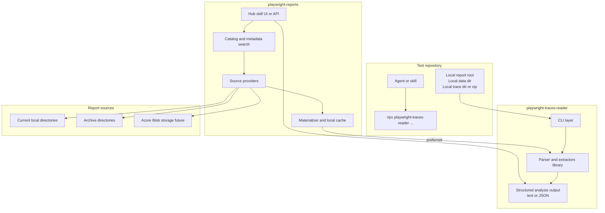

# Future CLI and Hub Architecture

This document describes the target architecture for `playwright-traces-reader` as it evolves from a parser library with a small scaffolding CLI into a parser library with a real analysis CLI.

The guiding decision is:

- `playwright-traces-reader` remains the parsing and analysis engine.
- Its CLI remains artifact-centric and operates on local resolved inputs.
- `playwright-reports` becomes the historical analysis hub and owns report discovery, metadata search, source resolution, and remote storage access.

## Goals

- Let agents and humans analyze Playwright reports via a stable `npx` command instead of ad hoc temporary scripts.
- Keep `playwright-traces-reader` usable as a lightweight standalone dependency in any test repository.
- Allow `playwright-reports` to import `playwright-traces-reader` and use the same parser engine for local directories today and remote-backed reports later.
- Keep the parser isolated from report catalog concerns such as metadata filters, Azure Blob access, and report lifecycle management.

## Non-Goals

- `playwright-traces-reader` should not become the source of truth for report inventory or metadata.
- `playwright-traces-reader` should not own Azure Blob access, database queries, or report search semantics.
- The CLI should not require a system-wide install.

## Architectural Positioning

### `playwright-traces-reader`

Owns:

- Low-level parsing of trace artifacts
- High-level extraction and summarization of failures, steps, network traffic, DOM snapshots, and timelines
- A local CLI for artifact-based analysis
- A skill scaffold for repositories that want direct local analysis
- Promotion of existing skill workflows into first-class CLI commands

Does not own:

- Searching across historical reports
- Metadata indexing or tagging
- Remote storage access
- Report retention, archival, or download policies

### `playwright-reports`

Owns:

- Historical report catalog and metadata
- Source providers for report locations
- Resolution of a report identifier into local materialized artifacts
- Future remote storage support such as Azure Blob
- Hub-specific agent skills and user workflows

Uses `playwright-traces-reader` as:

- An in-process library for parsing and summarization
- Optionally, a CLI for debugging or external workflows when process isolation is useful

## High-Level Architecture

## Main Boundary

The key architectural boundary is the handoff from the hub to the parser.

The hub may know about:

- report ids
- metadata filters
- date ranges
- current versus archive sources
- Azure Blob containers and keys
- caching and materialization policies

The parser should receive only a resolved local artifact input, for example:

- a report root directory containing `index.html` and `data/`
- a `playwright-report/data/` directory
- a single extracted trace directory
- a single trace zip path

This keeps `playwright-traces-reader` independent of where the report came from.

## CLI Shape

The future CLI should be designed around local artifact inputs, not around hub queries.

The existing skill workflows are the starting point for the CLI surface. In practice, the current `playwright-traces-reader` skills should stop teaching ad hoc script creation and instead map to supported CLI commands.

At a high level, the command families should look like this:

### 1. Setup commands

- scaffold skill files into a target repo
- print help and version

### 2. Report-level analysis commands

Accept a local report root or `data/` directory and return structured output such as:

- failed test summaries
- failure overview
- slow steps overview
- network issue summary
- commands that cover the current skill use cases for report-wide failure analysis

### 3. Trace-level analysis commands

Accept a single trace directory or trace zip and return structured output such as:

- full summary
- step tree
- timeline
- DOM snapshots
- network traffic
- commands that cover the current skill use cases for single-trace deep inspection

### 4. Output controls

The CLI should support outputs that are easy for both agents and humans to consume:

- plain text for quick terminal inspection
- JSON for agent consumption and further automation
- optional file output when a workflow explicitly needs a saved artifact

## CLI Design Rules

The CLI should follow these rules:

1. No dependency on a running `playwright-reports` service for core local analysis.
2. No direct database reads from `playwright-reports`.
3. No direct Azure Blob logic inside `playwright-traces-reader`.
4. Inputs should be stable local paths or clearly scoped local files.
5. Output contracts should be predictable and scriptable.

These rules preserve the package as a reusable parser first and a CLI second.

## How `playwright-reports` Uses the Parser

`playwright-reports` should treat `playwright-traces-reader` as a parsing adapter.

The recommended flow is:

1. Search or identify a report in the hub.
2. Resolve the backing source.
3. Materialize the needed artifacts to a local cache or working directory.
4. Call `playwright-traces-reader` on those local artifacts.
5. Return the analysis through the hub UI, API, or agent skill.

For `playwright-reports`, the preferred integration is an in-process import of the library rather than shelling out to the CLI. This is especially important once `playwright-reports` is deployed as a web service, where request-time process spawning should not be the primary integration model. The CLI is still useful for standalone use, debugging, local repo workflows, and direct use from test repositories.

## Materialization Contract

To support future non-local sources cleanly, the hub should normalize all sources into one local contract before analysis.

That contract should be one of:

- `reportDir` - local path to a Playwright report root
- `reportDataDir` - local path to the report `data/` directory
- `tracePath` - local path to an extracted trace directory or trace zip

This contract allows the source provider layer in `playwright-reports` to evolve independently. A source may be:

- a local folder already on disk
- a copied archive from another filesystem location
- a downloaded blob cached on disk

Once materialized, the parser sees the same input shape every time.

## Agent and Skill Strategy

The future split between skills should be:

### Skills in test repositories

Use `playwright-traces-reader` skills when the repository wants direct local analysis of its own Playwright artifacts. These skills should prefer invoking the CLI over creating temporary `.mjs` files.

The migration rule is simple: existing `playwright-traces-reader` skill flows should become backed by explicit CLI commands, so the skill becomes a thin instruction layer over supported commands rather than a source of embedded executable snippets.

### Skills in `playwright-reports`

Use hub-specific skills when the user wants historical or cross-source workflows such as:

- search reports by metadata and date
- analyze a report chosen from a catalog
- compare multiple reports
- analyze a report that had to be downloaded or materialized first

This split keeps direct local analysis lightweight while letting the hub own historical workflows.

## Why This Direction

This architecture is chosen because it preserves the reusable value of the parser while leaving room for `playwright-reports` to become a richer product.

Benefits:

- The parser remains portable and easy to adopt in any repo.
- The CLI provides a stable agent-friendly entry point without system-wide installation.
- The hub can evolve toward multiple storage backends without leaking that complexity into the parser.
- The same parser engine serves both standalone and hub-backed workflows.

Tradeoffs:

- There are two user-facing products to position clearly.
- The hub must own materialization and caching, which adds platform complexity.
- CLI commands must stay disciplined so they do not gradually absorb hub behavior.

## Phase-Oriented View

### Phase 1

- `playwright-traces-reader` grows a real CLI over existing parser APIs.
- Test repositories use `npx` commands locally.
- `playwright-reports` imports the library directly for parsing reports from local directories.

### Later phases

- `playwright-reports` adds remote-backed sources such as Azure Blob.
- The hub materializes remote reports to local cache and then invokes the same parser library.
- Hub-specific skills and APIs expand around report discovery and historical workflows.

## Decision Summary

- `playwright-traces-reader` is the parser and local analysis CLI.
- `playwright-reports` is the historical analysis hub.
- The interface between them is a local materialized artifact contract, not shared database access and not storage-specific parsing logic.
- If a report originates remotely, `playwright-reports` resolves and materializes it before parsing.